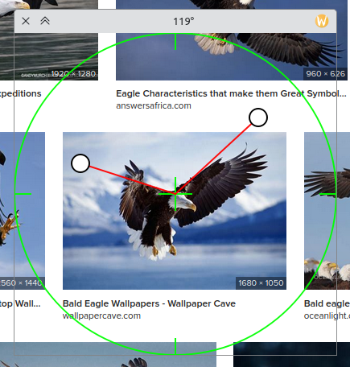

# qAngle

mini on screen protractor or angle measurement for linux.

```shell
cmake -S . -B build_dir \
      -DCMAKE_BUILD_TYPE=Release
      
cmake --build build_dir

./build_dir/qangle

mv ./build_dir/qangle ~/.local/bin/qangle
```

